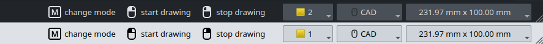

## Input Hints

Input Hints is feature that provides user with hints for available actions as part of the status bar.

Technically the hint consists of the displayed message with placeholders (`%1`, `%2`, ...)
corresponding to each key sequence, and key sequences. One hint can contain one sequence (`[M]
change mode`) or multiple ones (`[U]/[J] increase / decrease number of sides`). Each sequence can
consist of one or more keys (for example `[shift][M]`). Placeholders can be placed anywhere in the
hint message, however hints should follow `[key] action` convention. Available keys are defined
within `Gui::InputHint::UserInput` enum. 

Messages for hints should respect these rules:
1. Start with input, then lowercase letter, hint is not a sentence, e.g. `%1 pick radius`.
2. Keep hints as short as possible, avoid redundancy if context is clear, e.g. `%1 pick arc center`
instead of `1% pick center of an arc`.
3. Start with modifiers only (`ctrl`, `alt`, `shift`, etc.) if they affect other inputs, then mouse inputs, then  normal keys.
4. Ideally within groups hints should be ordered by frequency of use (more common actions should be
first).
5. Try to be specific - instead of `change mode` try creating a dynamic hint with the name of the
next mode. 
6. If actions are similar but differ in minor detail - they can be combined, e.g. `%1 / %2 decrease
/ increase side`, `%1, %2 or %3 constrain axis`.
7. Remember to use translate function!
8. Due to limited space available - try to keep the list of actions short, ideally no more than 6
hints. Focus on the most common and important actions.
9. Avoid adding unnecessary hints, e.g. don't show navigation commands as hints, when tools are
active and don't show hints which are currently not possible due to other actions.
10. If hints change dynamically - keep common hints between states of the tool used. If given action
is removed, it is a strong suggestion that it is no longer available.