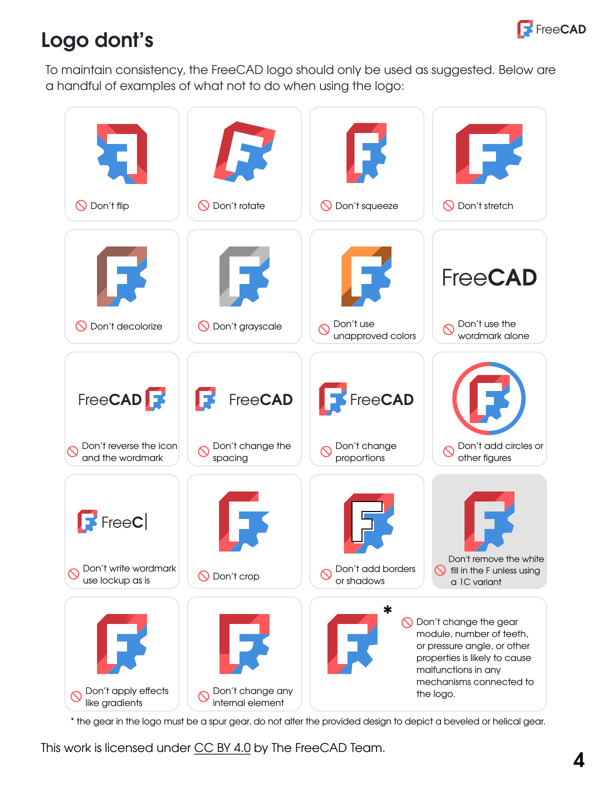

# FreeCAD Brand Guidelines

The brand guidelines describe the proper use of the FreeCAD logo and other FPA branded resources.
This is an excerpt of the official [FPA site for the FreeCAD brand guidelines](https://fpa.freecad.org/handbook/process/logo.html).

- [Logos](#logos)

  - [Logo Kit](#logo-kit)

  - [Wordmark](#wordmark)

  - [Symbol](#symbol)

- [Colors](#colors)

- [Use](#use)

- [Scale and Whitespace](#scale-and-whitespace)

- [Do nots](#do-nots)

- [PDF Guidelines](#pdf-guidelines)

## Logos

### Logo Kit

The logo is being used to brand and identify official FPA projects (FreeCAD) and content.
Third parties can only use it to provide credit for FreeCAD or to link to [freecad.org](http:/freecad.org).

You can download the logo kit including guidelines:

[Download Logo Kit](../images/logo_kit.zip)

### Wordmark

The logo consists of two elements: the *F* symbol and the wordmark. The text uses the [Evolventa](https://evolventa.github.io/) font family, in regular weight for "Free" and in bold weight for "CAD". It should not be recreated but instead used as provided, either in the dark or light version.

### Symbol

The symbol has two versions:
1. Full color (primary) which is the preferred version
2. Mono / 1C (secondary) as fallback and only used in the color *Tufts Blue*, *Light Red*, *Off Black*, or *White*. No other colors or gradients and effects should be used

## Colors

The FreeCAD logos must always appear as one of the primary brand colors. This includes *Tufts Blue*, *Light Red*, *Dark Red*, *Off Black*, and *White*. These colors should also be used for other branded applications.
Regardless of the used symbol, the wordmark *FreeCAD* must always be used in either *Off Black* or *White* as provided in the logo kit.

- **Tufts Blue**, [#418FDE, RGBA(65,143,222,1), CMYK(73,36,0,13), PMS 279 C](https://encycolorpedia.com/418fde)

- **Light Red**, [#FF585D, RGBA(255,88,93,1), CMYK(0,64,64,0), PMS 178 C](https://encycolorpedia.com/ff585d)

- **Dark Red**, [#CB333B, RGBA(203,51,59,1), CMYK(0,75,72,18), PMS 1797 C](https://encycolorpedia.com/cb333b)

- **Off Black**, [#212529, RGBA(33,37,41,1), CMYK(20,10,0,84), PMS BLACK C](https://encycolorpedia.com/212529)

## Uses

The FreeCAD logo is provided in several distinct flavors for the following applications:

* Primary (full color): the primary version of the logo should be used the majority of the time, on any background so long as it is clearly legible
* 1C (mono) in Off Black or White
* 1C (mono) in Tufts Blue or Light Red

Each of the 1C (mono) variants consists of one solid color, with the *F* as negative space. Use the provided symbols, do **not** fill the *F* with white, and always choose the version of the logo that achieves the most desirable contrast against the background and other elements in a given design.

When using other text elements in association with FreeCAD, use the [Evolventa](https://evolventa.github.io/) font family, but don't recreate the wordmark manually.

## Scale and Whitespace

To retain legibility and integrity, the primary and secondary FreeCAD logo should be displayed not smaller than 32px and 16px, respectively.

To ensure that the logo is clearly visible in all applications, surround it with sufficient clear space.
It must be used with enough space around the logo and should not touch the borders of the image / application or other artwork elements and text.
Don't add text directly next to the logo and don't use a slogan next or under the wordmark.

When used with other logos and partner brands, all logos should be of equal size and have enough distance to each other.

## Do nots

To maintain consistency, the FreeCAD logo should only be used as suggested above and provided in the logo kit.
You should **not** alter colors, shape, style, or apply any effects such as gradients, borders, shadows, or outlines.

We have made some examples of what **not** to do when using the logo:

## PDF Guidelines

Download the [FreeCAD brand guidelines](../images/guidelines.pdf) as a PDF. These are also included in the logo kit at the top of the page.

[Return to Design Guide Main Page](.)
