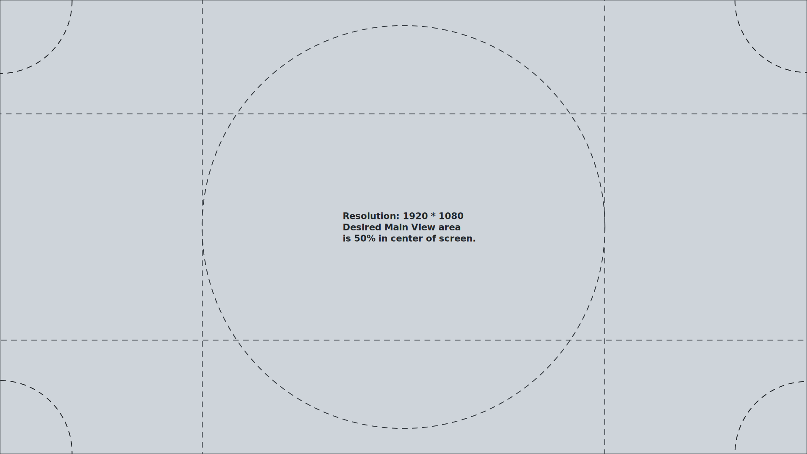
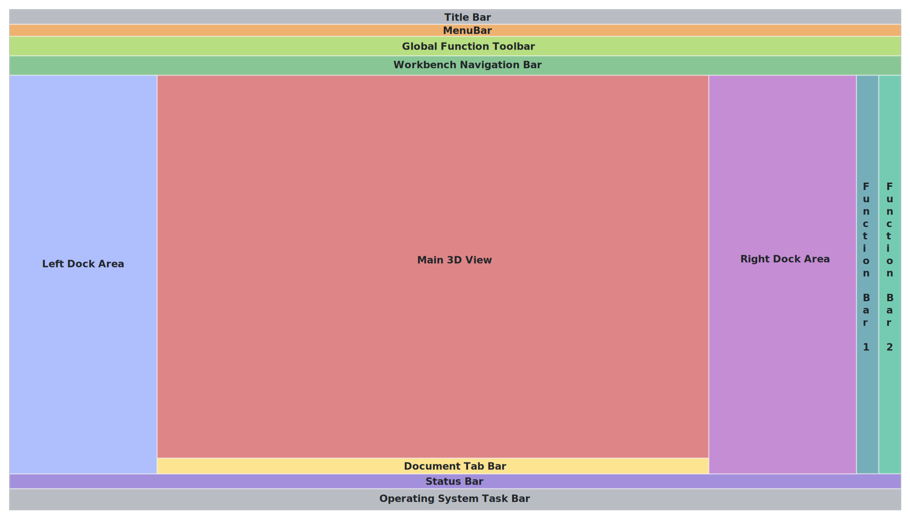

# Zones

The circle shown in the image below can be considered a 'hot zone' where a user should be able to focus attention on the work/task being performed.

*Note: the corners have ease of positioning of the mouse cursor. Special use of screen corners should be reserved for global application functionality only and not implemented without careful deliberation.*

Below is the notional zone layout of the FreeCAD user interface, specific sizes mentioned for each zone are to be considered critical to the goal of reserving 50% of a user's display for the Main 3D View (or document area) while still providing easy access to information, navigation and tools. Each zone is described below.

**Title Bar:** Windows 10 standard is a height of 32 pixels. Any modifications to this area has to be carefully considered because of cross-platform compatibility and should only be done in the core of FreeCAD. Individual workbenches should not attempt to modify it.

**Task Bar:** Windows 10 standard is a height of 48 pixels. This element is a fixed size and follows the same rationale and guidelines provided for the Title Bar.

**Menu Bar:** Standard height is established as 32 pixels in the stylesheet. There shall be no insertion of non-standard elements (ie. QComboBox) in this area by individual workbenches. New menus can be added, however they should ideally be confined to the menu named after your specific workbench. Simple addons should insert entries into a menu titled "Accessories" if applicable.

**Global Function Toolbar:** By default, FreeCAD uses a height for horizontal toolbars of 40 pixels with icons size of 24px. Total icons displayed on this toolbar shall not exceed a total of 44 in order to prevent clipping on a 1080p display. This toolbar is primarily designated for global functions across any workbench. Unused space can be populated with workbench related settings and controls (ie. grid, snap, unit, controls) rather than work features.

**Workbench Navigation Bar:** This zone is reserved for a tab-bar style widget (default 32 pixels high) intended to provide easy navigation between active workbenches with a single click. This area shall remain dedicated for this purpose only.

**Main View:** This area is dedicated for displaying the work being performed. Overlaying of minimal elements is allowed. Widgets overlaid in this area should be limited to the outer edges and corners, such elements shall be used sparingly and be sized and positioned with consideration for the reference resolution (1920 x 1080).

**Left Dock Area:** This zone shall be used for document and/or library data access. By default this area will contain the document "Tree View". Use of overlay transparency is preferred to maximize visibility of the Main View and allow greater emphasis and focus on the work being performed. Other persistent state panels should have intermittent visibility. A toggleable state 'slide-out' panel would be preferred for such elements. All efforts should be made to constrain panels docked in this zone to 300 pixels in width.

**Right Dock Area:** This zone is for interactive 'tasks' panels. Overlay transparency mode is the recommended default state for this element. These 'tasks' are for displaying options relative to workbench functions. All efforts should be made to constrain panels docked in this zone to 360 pixels in width.

**Function Bar 1, 2, etc:** By default, FreeCAD will set these toolbars at a width of 40px assuming an icon size of 24px These toolbars are for holding the features/functions of a given workbench. These are docked to the far-right edge of the screen in accordance with the law of proximity in order to minimize mouse travel distance from starting a feature/task to modifying its settings.

**Document Tab Bar:** This is used for tab navigation of various document windows only. By default, a height of 32px is adhered to. This area shall not be modified in order to avoid user confusion while navigating multiple open documents.

**Status Bar:** The status bar provides contextual information about the position of the mouse cursor in relation to the objects in the main view. This section of the UI is also home to some global controls within FreeCAD. They are "Notifications", "Navigation Style", and "Unit Selector". Developers shall not insert non-global elements or widgets into this area.

[Return to Design Guide Main Page](.)
