# Getting Started

If you don't already have CLion installed, download it, license it, install it per JetBrains instructions.

### Checking out FreeCAD

**Command line:**   `git clone https://github.com/FreeCAD/FreeCAD` and then File -> Open or New Project on that directory.

**IDE:** From upper left, choose Project from Version Control.   Use https://github.com/FreeCAD/FreeCAD
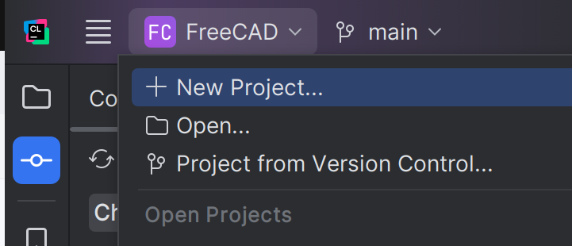
### Building CMake

CLion should automatically refresh the CMake build for the application.  You see results or rerun using the cmake
selection at the lower right
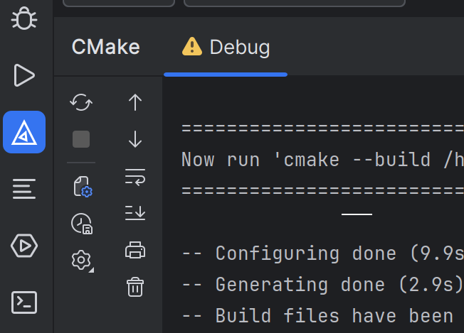

### Building Application

Choose a configuration ( Debug ) and a target ( FreeCADMain ) from the top bar.  First time through, use the menus to
run 'Build All in Debug' from the Build Menu.  After that point you can generally just Run or Debug and it will build
any dependencies for you.  Note that if you switch branches you may sometimes need to "Rebuild All in Debug" to force
a clean full rebuild.

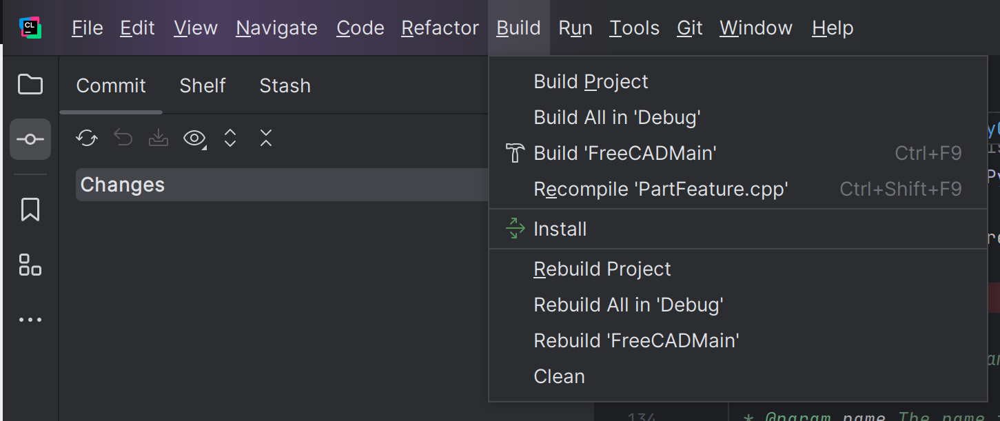
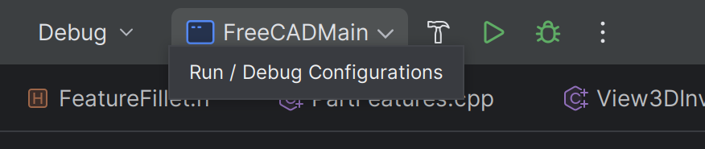

### Running Application

Use the Run or Debug Icons from the top bar shown in the prior image.

## Debugging

*note* This depends on https://github.com/FreeCAD/FreeCAD/pull/16850 getting merged!

While CLion supports both a C++ debugger and a Python debugger, it generally does not support
embedded Python interpreters, nor debugging both simultaneously.  However, there are workaround
procedures that will allow this.

### Basic C++ concept

CLion invokes an underlying debugger that launches or connects to the program under
test.  You can see this in the "Attach to Process" dialog under the Run menu.  After
choosing a process, you will be asked to attach with GDB or LLDB; CLion uses the
appropriate API to communicate with the debugger, which uses OS specific mechanisms
to control the program under test.

### Basic Python concept

The pydevd debugger is run inside of the python interpreter under test.  This provides
a network socket, normally connected _from_ the interpreter under test to a listening
socket in the controlling debugger UI.  This port defaults to 5678 for non-CLion uses.  CLion
generates a random port number, and then passes this into the pydevd initialization code;
if you run a python program then this is accomplished by directly running a shim with
parameters that include the port number and the program to be debugged.  In an attach
scenario, CLion _launches a C++ debugger_ to inject the pydevd initialization into the
running python interpreter and cause it to make the socket connection back to the UI.  Note
that since you generally cannot have more than one c++ debugger attached to a program,
this mechanism cannot work for a program already under c++ debugging, and since it assumes
that the c++ program is in fact a python process, it won't work for embedded python either.

### Technique for getting Python testing working

The challenge here is to get CLion to listen on a port for the incoming connection from pydevd,
and to execute pydevd on that port in the program under test.  Since CLion does not support this
natively, we trick it.  To do this we need to have a pydevd installed in the python interpreter in
FreeCAD.

### Running a basic c++ debug

Simply choose the debug option to start FreeCAD, and you're good to go.

### Setting up for python debugging in CLion

Install pydevd in the interpreter that FreeCAD is using.  'pip3 install pydevd' from the correct
venv is one way to accomplish this.

Use the settings button in the upper right, the File Menu -> Settings, or the Ctrl-Alt-S shortcut
to open the settings dialog, expand the Build, Execution, Deployment tree item, and select a Python
Interpreter:

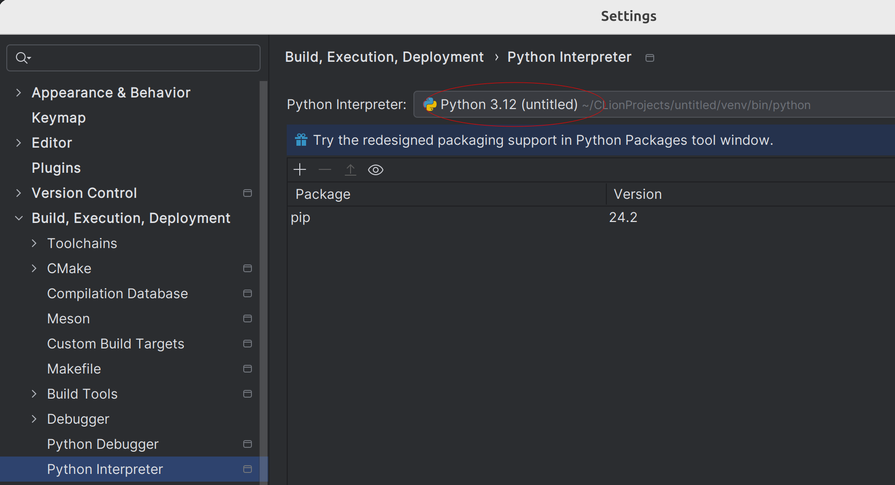

Switch to the Python Debugger settings, and change the Attach To Process name from python to 'Freecad'
You may need to change this back if you use the IDE for other applications.

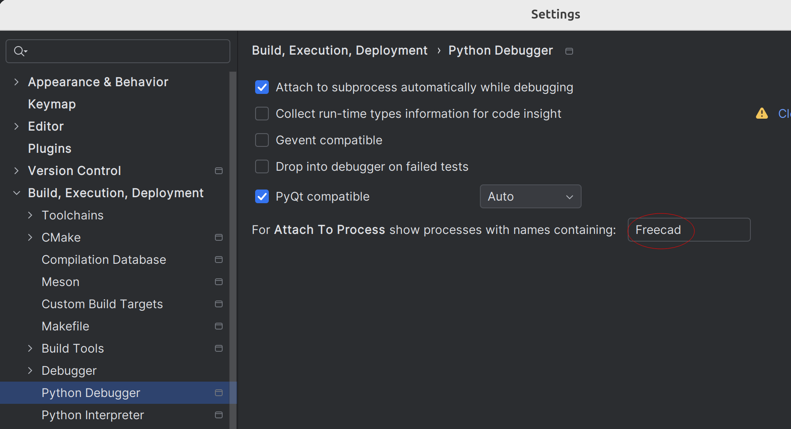

Now there are three approaches here:
1. Wait for CLion 2024.3 which is supposed to have a static port listener option with a
configurable port available in the 'Python Debugger' pane of the CMake profile you use.
   [see context](https://youtrack.jetbrains.com/issue/CPP-5797/Cross-debugging-Python-and-C#focus=Comments-27-10655987.0-0)
   and [see planned fix.](https://youtrack.jetbrains.com/issue/PY-21325/Add-an-ability-to-specify-debugger-port)  Port should be 5679 if you use the macro below.
2. Find the attach_pydevd.py file in your CLion installation, and modify it using the
contrib/clion/attach_pydevd.py.patch in the source code.  Then use the macro below.
3. Use this elaborate work around:

### Running a python or simultaneous debug using the non intrusive procedure

1. You can start your FreeCAD independently, via CLion, or in c++ debug mode under CLion.

2. Regardless of the starting technique, once FreeCAD is up, if there is no code in your FreeCAD supporting
   CLion debugging, then:
   1. Go to the python console and import pydevd.
   Then go ahead and pretype in the settrace call, leaving the cursor poised to enter a port name but not executing the line.
   2. Alternatively, go to the Macro -> Attach to remote debugger dialog and switch to the CLion tab.

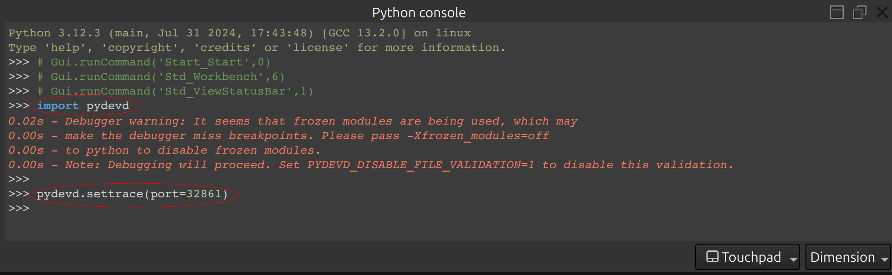

3. Return to CLion, and start Attach to Process from the run menu:

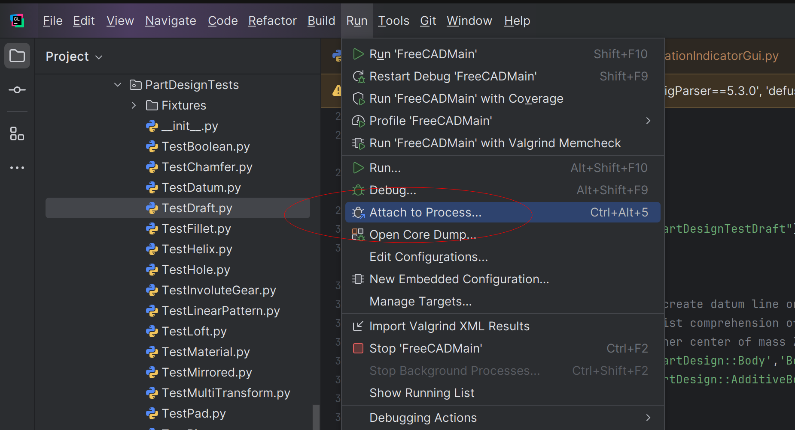

4. Find the Freecad process, which may be well down at the bottom of the list.  It is the configuration
from earlier that makes Freecad processes appear in the list as Python debuggable.  Highlight this entry
and press the Attach with Python Debugger button.

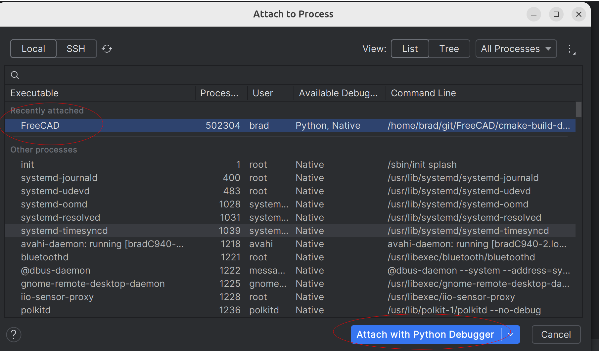

5. Now it's time to move FAST.  You have about 10 to 15 seconds to complete the following:
Scroll to the top of the console window and find the (random) port number that CLion has chosen to listen
on.  Ignore everything else:

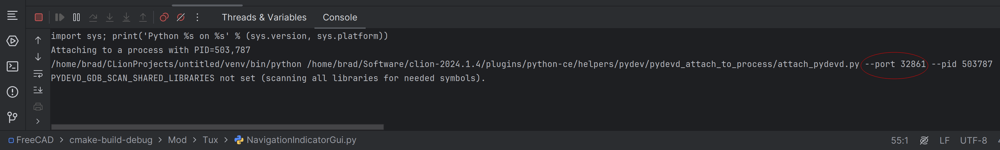

6. Switch to the FreeCAD window and complete the port number in either the console's settrace line or the attach dialog
and execute it:

7. Note the appearance of a "Connected to pydev debugger" line in the CLion console.  Shortly before or after that
message, you will also see the timeout of CLion's attempt to use a debugger to trigger an attach.  Ignore this
error.

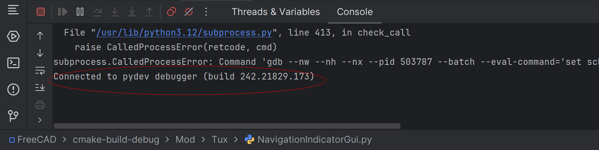

8.  Proceed to debug normally:  any existing breakpoints you have either in c++ code or python code will be hit, you
can step, examine variables, the whole deal.

### Running a python or simultaneous debug using updated CLion or the patched attach_pydevd.py

1.  Start FreeCAD running.  You can do this from any place for just a python debug; or you can launch a c++ debug
in CLion for simultaneous debugging.
2. Run the contrib/clion/GetCLionDebugPort.FCMacro in FreeCAD.  The cleanest way to do this is just to add it as
first parameter of the FreeCAD or FreeCADCmd command line.  Editing your FreeCADMain run/debug configuration in
CLion is the best way to do this - set it once, and python debugging is always there whether you run a c++ debug
or not, with no effective performance penalty.

#### Caveats

- Sometimes you may get one spurious breakpoint hit in the python debugger.  Just hit the continue run button to keep
going.  FreeCAD triggers a python exception during startup, and the default CLion debugger settings are to break on this
- condition.
- The python files are copied from the source into the build directory.  You must use these build directory versions
of the python files if you want to set breakpoints.  So if you're built to `cmake-build-debug` for instance, then you
- want `cmake-debug-build/Mod/BIM/Arch.py` and not `src/Mod/BIM/Arch.py`.  This also means that you need to be careful
when editing files - anything in the build directory is essentially temporary and will be overwritten on the next build,
but if you change something in the source directory then you need to run a build on an appropriate target to copy the
changed python file to the build directory.  CLion does not support specifying mapping directories for this python code,
and there is no evidence of it changing soon.
