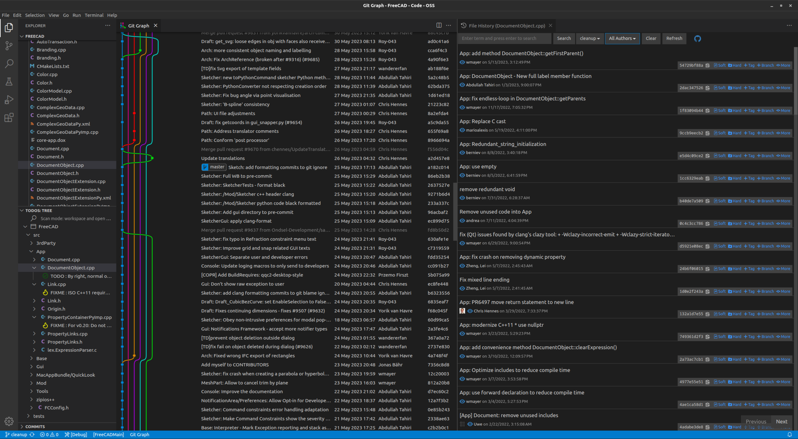

# Getting started with VSCode

A convenient way of working with the FreeCAD source code is to use an IDE or Integrated Development Environment. The FreeCAD repository contains a VSCode configuration which makes it particularly easy to get started with.

Get VSCode here https://code.visualstudio.com/download and Git here https://git-scm.com/downloads

After that go to github and create your own fork of the FreeCAD repository by clicking the fork button. Once that's done, clone your fork to your local computer that you will be using for development.

Note: if you are using VSCode on an Ubuntu based Linux, please avoid using the snap version - it won't work properly with FreeCAD.

```
git clone https://github.com/YourUsername/FreeCAD --recurse-submodules
```

Open VSCode and select `File > Open Folder`, then select the folder where you have cloned your fork of the repo.

Be sure to copy the `.vscode` folder inside `/contrib` to the root directory of the repo (`/.vscode`)

VSCode will probably ask to install the recommended extensions: say `yes`. If it doesn't you'll need to manually install these extensions
```
ms-vscode.cpptools-extension-pack
ms-python.python
```

## Select build configuration

<video autoplay muted playsinline loop src="resources/configure.mp4" type="video/mp4"></video>

First on the bottom left corner, in the status bar, select the build type. Options are:
- debug
- release
- conda debug
- conda release

If you are using conda please select one of the respective ones.

Cmake should automatically configure the project with the selected configuration.

## First build

<video autoplay muted playsinline loop src="resources/build.mp4" type="video/mp4"></video>

To build, either:

- Run [Pixi](./index.md#pixi) (**Recommended**), or
- Press `Ctrl + Shift + B`, or
- Click the build button with the cog icon in the status bar, or
- Run the `CMake: build` task

**NOTE:** The first build takes a while.

**NOTE:** If you change configuration (see step above) you will have to build again.

## Launching the built executable and debugging

<video autoplay muted playsinline loop src="resources/debug.mp4" type="video/mp4"></video>

On the left panel go to the debug section and click the little green play button. Alternatively press `F5`. Every time you launch the debugger a build is triggered, to ensure all the latest changes you made to the code are compiled in.

You should see freecad launching and the debugger attaching to the process. If an error pops up the python debugger failed to attach (there's 30 second timeout).
Close FreeCAD and try launching it again. If it still fails try increasing the timeout located in the file `.vscode/scripts/WaitForDebugpy.py`

To debug please refer to the [documentation](https://code.visualstudio.com/docs/editor/debugging#_debug-actions) or search for a tutorial online.

**NOTE:** VSCode has an option called 'run without debugging'. This doesn't work, don't use it. If you just want to run the application launch with `F5` and ignore the debugger.

**NOTE:** There's actually two debuggers: on the top panel you can see a dropdown to select either the c++ debugger or the python one.

**NOTE:** Don't use the restart button. It only restarts the selected debugger, which definitely is not what you want. Instead press the stop button (which stops both debuggers) and launch again.

## Running tests

<video autoplay muted playsinline loop src="resources/testing.mp4" type="video/mp4"></video>

The IDE supports running FreeCAD tests as well. On the left panel go to the testing section and click the play button. A build takes place and then all the tests are run and results reported.

**NOTE:** This is much slower than running the `Tests_run` executable directly (run `path/to/the/build-dir/tests/Tests_run`). The video above is sped up.

**NOTE:** Only c++ tests are currently integrated. Python tests are run from the `Test workbench`, or with the command `FreeCAD -t 0`, or `pixi run freecad -t 0` if you're using Pixi.

Alternatively, there are two vscode tasks that can be used to run the cpp and python tests directly.

**NOTE:** The debug tests button does not currently work. More configuration is needed to get that to work.

## General features of VSCode

On the left panel you can see the following sections:

- File manager: here you can control fils and search them with `Ctrl+F`. Press `F2` to rename the selected file.
- Source control: here you can control git from the graphical user interface.
- Search: powerful tool that can search all files and replace text.

In the status bar on the bottom:
- You can see which branch you are on and change it from there
- Click the error/warning counter to open the `PROBLEMS` panel. Here you will have a convenient collection of all the compiler warnings, cmake warnings, and problems from the workspace.

General editor useful shortcuts:
- Rename all occurrences of a symbol (e.g. a function name) with `F2`
- Easily navigate code with the tools in the right click menu. For example `Go to definition` and `Find all references`.
- Press `Ctrl+P` and type a file name to jump to that file.
- Press `Ctrl+F` to search the current file.
- Use `Alt+Up/Down` to move rows of text up and down.
- Use `Ctrl+C/X/V` without selecting any text to copy/cut/paste entire rows.
- Use `Ctrl+Shift+Up/Down` to create more cursors and edit many rows at the same time. Press `Esc` to go back to one cursor.
- Hold `Ctrl` while moving left/right to move the cursor entire words at a time.
- Hold `Shift` while moving left/right/up/down to select text with the cursor.

Read the documentation for more:

- [basic editing](https://code.visualstudio.com/docs/editor/codebasics)
- [code navigation](https://code.visualstudio.com/docs/editor/editingevolved)
- [refactoring](https://code.visualstudio.com/docs/editor/refactoring)

Other useful extensions, recommended but not necessary are
- ```gruntfuggly.todo-tree```: Scans all the files and reports where particular keywords appear. For example `TODO`, `FIXME`, `BUG`...

- ```mhutchie.git-graph```: Helps visualize git commits and branches.

- ```donjayamanne.githistory```: Adds two buttons to the right-click menu: `git: view file history` and `git: view line history`




- On the very left you can see the `Todo-Tree` extension reporting `TODO`s and `FIXME`
- On the left half you can see the `git graph` extension showing all the commits on different branches. You can click a commit to see exactly what was modified by it.
- On the right half you can see the `git history` of the DocumentObject.cpp file.
