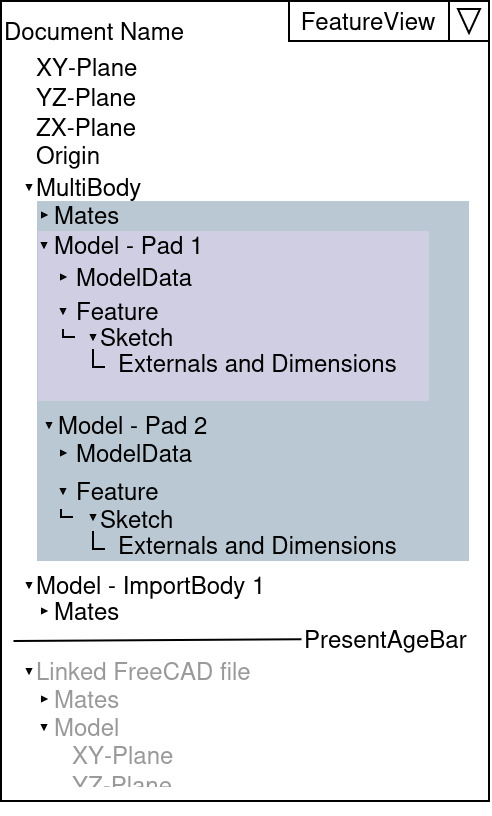

# ComboView - History of a Universe  

The ComboView is the most important Part beside the MDI-View.  

## History  

Working on a Model will end in a tree like structure thad define your Model. The slim ComboView itself is not able to show the tree. A slim way to show a tree and have a easy way to not miss the important references complete, is a History structure. If you work with a History you avoid to work with references on parts of a tree that not exist on a certain point.  

If you work with a clear history, you need a TimeLine as a kind of time machine.  

  

## Naming  

Because of the closeness to historical aspects we use terms from this field.  

*   Historic dependencies could be addressed by Parents and Children.  
    
*   A collection of historic dependencies is called Era.  
    (We don't use Family because that term in some CAD has a different meaning)  
    
*   Moving in the History is like using a time machine, for that we use a PresentAgeBar.  
    

## Structure  

Structure View  

FlatView is a View that shows the Content in the Combo view in a pure historic view. This Historic view is identical with the order FreeCAD would calculate (if no multiprocess)  
  

The BOM-View shows the BOM structure. This is autogenerated by Dependencys of bodies. Her you could change the position and fill some properties.  
  

This is the FeatureView which has a focus on showing reference dependencys.  

Details se below.  

  

  
  

DocumentName  

*   📦 Model - Feature Name  
    The existence of this Model start with the first feature that creates it.  
    The Model entry contains two icons. The feature Icon and the general body Icon.  
    *   Feature  
        *   Sketch
            *   Externals and Dimensions  
                Such as Plane, and other geometry that used by the sketch. Also Dimensions with values.  
                
    *   SubModel  
        SubModels exist, if references for creating this new Model is based on another Model e.g. Sketch on a Surface of _Model - Pad 1_ and relation on other external edges. to create a new Body  
        

If a body has references from another body, both Bodies are automatically merged in a MultiBody Object, this is because that way you could see at the first glance, that bodies depending on others, also it is not possible to create a mate between two bodies that already linked by sketch relations.  

## Possibilities  

*   Era - (Directory)  
    An era defines a historical area that concerns a certain interdependent set of features. It is not possible to omit individual elements in between. Normally an Era define a specific part of a volume and all features that are needed to get it.  
    
*   PresentAgeBar  
    Is a kind of Time machine that allows you to travel back in time and see how a file looks like in the past. It helps also to place references and sketch relations on geometry that are in the correct relation to the new feature.  
    If you modify an item the PresentAgeBar moves to the historic point where it is located and shows the shape of the body on that time.  
    **IMPORTANT**: It's not possible to create references and relations to geometry that exist in the Future. So References and relations could only been established to items created before the current PresentAreaBar.
