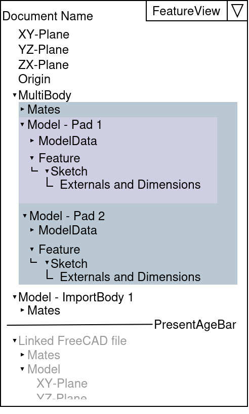
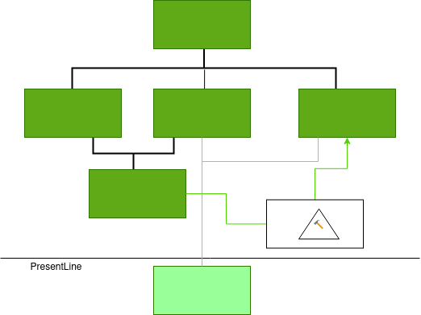

# Style Guide ComboView in PartDesign  

This document is still a work in progress. Please leave a comment in the chat or highlight some text and click on the tooltip to comment. This document is related to "Style Guide "ModernUI 23" FreeCAD"  

This document assumes the TNP problem is solved.  

The PartDesign Workbench uses a parametric, feature editing methodology, which means a basic solid is sequentially transformed by adding features on top until the final shape is obtained.  

This behavior requires a history-based approach to design. A feature may depend on one or more other features, resulting in a relationship tree.  

Even if the TNP problem is solved, it is recommended to design a flat hierarchy.  

This style guide is intended to help design the FreeCAD interface and create a simple user interface that is intuitive and easy to understand.  

1.  ComboView --> DataAndHistoryPane (TreeView)  
     --> See also the [MultiBodyPart vs. Assembly Problem](MultiBodyPart-VS-Assembly-problem.md)  
    
      
    
      
    
    1.  _Model_ History Tree  
        Contains the Body modifying History. Has a command that temporary replaces the 3D-Area with a Treeview that shows Relation between Features.
        *   Feature  
            *   Sketch  
                *   Plane (The DatumPlane, or a relation to a face)  
                    
                *   Relations to other Feature, sketch or body They highlight the related objects on Mouse hover  
                    
            *   PropertyPane (optional)  
                Allows to Split feature with a lot of settings into smaller parts, so specific settings are easier to find and modify.  
                
            *   ModelData  
                *   Body BOM-Settings  
                    Use as "part" or "construction", physical properties like Material and density, etc.  
                    
                *   Body Properties (only if BOM-Settings are none or part)  
                    
                *   Property and value table  
                    (Label, Description, calculated weight, max dimension, etc.)  
                    
    2.  Reference List  
        List of data links from this document to external document.
