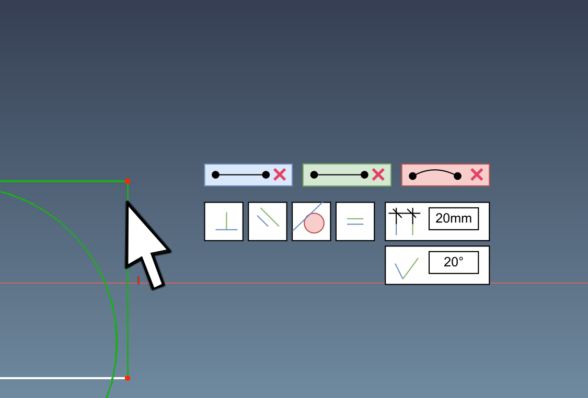

# Rules for Feature  

Every Feature has to define what type of Input is allowed. Assume that you preselect things and after that run a feature. This feature could take the preselected content that matches a type it understands. In best cases no other selection is needed. It's not up to the Feature Designer to decide if such kind of working is possible or not.  

A good example could be a tooltip that shows possible relations that work with your selections. e.g.: [https://forum.freecad.org/viewtopic.php?p=582953#p582953](https://forum.freecad.org/viewtopic.php?p=582953#p582953)  

  

  

If you successfully finish a new Feature the Feature is saved into the ComboView:  

*   It's saved onto the place where the PresentAgeBar is located.
*   This Feature contains the Script and all parameter to fulfill its purpose and allow recalculation.  
    
*   Information has to be stored inside the Feature:  
    It helps to Update Feature and solve errors.  
    *   Needed dependency like Workbenches and others.  
        
    *   Version of FreeCAD, Workbenches and this feature itself.  
        
    *   Date where this feature was created and modified  
        
*   Modifying a feature brings back the same Task Dialog that it was used to create the Feature.  
    
*   It has to work even a Workbench is not active which created a feature. That not means that all settings have to be available but at least:
    *   it has to be possible to modify and change dimensions  
        
    *   It has to be possible to repair references  
        
    *   Settings that need a loaded Workbench, shows a Menu entry to load the Workbench and after that made the settings visible for modifying (in background without left this task)  
        
*   While modifying a Feature, it has to allow: 
    *   Measure  
    *   Create temporary visual Cut to find hidden things.
    *   Every Feature that could increase volumes could also reduce (cut) volume and between this by a single click.
    Setting could be preset and hidden, if in most use case not needed
    (e.g. in Arch the wall feature)

    *   Every Feature that add/remove volume could also split a body into several and also merge several bodies into one.
    Setting could be preset and hidden if in most and usual use cases not needed 
