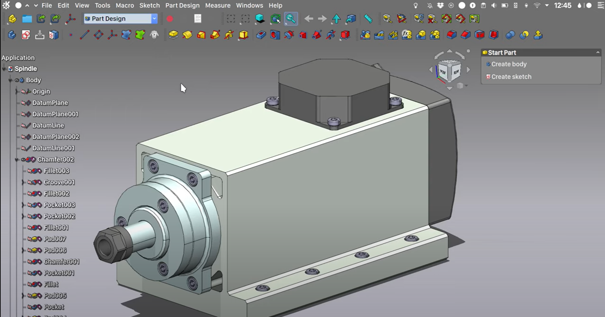

# Stylebook

The stylebook provides guidelines and explanations for visual elements in the FreeCAD application

This book is meant to document the general style and conventions of the FreeCAD User Interface. Guidelines, terminology, and philosophies described here will be used to justify changes in the current UI in order to make the overall user experience more consistent, predictable, intuitive, and attractive in the future.

In the short term, this book surely will undergo massive changes and reorganization. It will also serve as an important part of a larger discussion within the FreeCAD community. Feel free to link to existing issues and pull requests, and projects.

In the long term, the book should settle down and become primarily a resource for developers and designers to refer to. Most links should be removed.

Note: The stylebook is a catalog of _guidelines_.  These are not hard laws to be followed. The overarching principle is to make the user interface intuitive and welcoming. If blindly following a guideline does not serve that purpose, then ignoring the guideline is acceptable.  However, the _right answer_ is to refine the guideline here to account for what has been learned.

## Subpages
[Glossary](./glossary.md)  [Navigation](./navigation.md)  [Selection](./selection.md)  [Toolbars](toolbars.md)

## Parts of the UI

1. Workbench Switcher
2. Toolbars
3. Toolbar Area
4. ComboView
5. TreeView
6. Property Pane
7. The MDI View
8. The MDI Selector
9. The Report View
10. The Python Console
11. Status Bar
12. Navigation Cube

### Workbench Switcher

The workbench switcher is an important control to the general FreeCAD workflow. It is the primary way for the user to switch workbench contexts.

#### Guidelines

1. The workbench switcher should always be available to the user. It shouldn’t jump around.  

#### Problems

1. The switcher itself has no accelerator key associated with it. The user must click with a mouse.
2. The first ten workbenches are automatically assigned an accelerator of W &lt;#>. The user has no control over the assignment of accelerators.
3. By default, all workbenches installed in FreeCAD are shown. This includes workbenches that are of marginal value or seldom used, especially by new users. This contributes to confusion since users don’t know yet which workbenches they need to use.

### ComboView

The combo view contains the tree view and the task panel area.

#### Guidelines

tbd

#### Problems

tbd

### TreeView

#### Guidelines

tbd

#### Problems

tbd

### Property Pane

The property pane shows properties of the selected object. Properties are sorted in groups.  Right clicking gives an `Autoexpand` option and a `Show All` option. The developer has discretion about which properties are automatically shown. In practice almost all options are available because the developer probably hasn’t thought about it. Many of these could probably be hidden by default to make the list shorter and less cluttered.

#### Guidelines

tbd

#### Problems

tbd

### MDI View

The MDI view has the most usable space. This is almost always the 3D model except for spreadsheets and the TechDraw workbench. It could be used for other tasks when the user’s focus is needed for a long time or to give a maximum view of something (raytraced image).

#### Guidelines

tbd

#### Problems

tbd

### MDI Selector

#### Guidelines

tbd

#### Problems

tbd

### Report View

#### Guidelines

tbd

#### Problems

tbd

### Python Console

#### Guidelines

tbd

#### Problems

tbd

### Status Bar

The status bar is the only part of the UI that is always the same regardless of workbench, task or mode. That makes it special.  

#### Guidelines

1. The real estate is very limited so it should be protected and used very sparingly and wisely. For example the mouse model switcher probably doesn’t need a label. An icon with a tooltip is sufficient and would use only 1/4 of the space it currently occupies.

#### Problems

tbd

### Task View

Each tool should put all of it’s settings in a single task box.

Task panels should never require scrolling.

Double clicking on an item in the tree view will show a task panel if one is available.  If there was a task panel used to create an object, double clicking should show THE SAME task panel to edit the object. _(I’m looking at YOU, Draft workbench! You too, Arch)_

Task panels should always produce a valid output if the `OK` button is pressed. If a valid output isn’t possible, don’t enable the ‘ok’ button. -> _This is interesting but I wonder how it could be done._

Task panels should always start with valid defaults (e.g. the shapestring dialog should have a default font. It should preview the text in the 3D window.

Task panels should always preview their results in the 3d window. If a preview is computationally too intense, provide an `Apply` button to generate a preview. _(I’m looking at YOU, shapestring tool!)_

## Context Menus

tbd

### Guidelines

tbd

## Widgets

#### Guidelines

1. FreeCAD has a custom QT widget for displaying units. The control will convert the displayed units based on the users selected unit schema.

## Tables

When a table is used to display rows of items with multiple elements, such as the workbench preference page, the first column should be the icon/name of the element. This first column can be preceded by a checkbox only if it is an activation checkbox. The rest of the UI elements should follow after, in an order that makes the most sense to the user.

## Terminology

FreeCAD has a major terminology problem for new users. We have a Part workbench that doesn't make Parts and a Part Design workbench that isn't used to design Parts. We have Pads and Extrudes, Pockets and Cuts, Fuses and Unions, etc. We have a Part container and a Group container(?) but no core functions to populate a container (e.g. a core assembly function).

## Philosophy

There should be one -- and preferably ONLY one -- obvious way to do a task. Developers are notorious for giving users options thinking that is a good thing. In reality, every tool takes time to understand. Given two nearly identical implementations of the same workflow, the user has to figure out how they differ. Don’t make the user think.

Never present the user with an enabled tool that is broken, non-functional, or cannot be used in the current context. Some examples:
- It should not be possible for the user to initiate the 'export' operation
   without a document open because there is nothing exportable.
- A workbench which requires the user to install something extra to be useful
  should not be part of the workbench switcher if the extra thing is not installed.
- A toolbar tool that groups related tools together should be disabled if all
  the sub-tools are disabled.

## Resources

Here are some resources concerning UI/UX design.

[Don't Make Me Think: A Common Sense Approach to Web Usability](https://www.amazon.com/Dont-Make-Me-Think-Usability/dp/0321344758) by Steve Krug - A decent book mostly about web usability but the core ideas are sound.

[Laws of UX: Using Psychology to Design Better Products & Services](https://www.amazon.com/Laws-UX-Psychology-Products-Services-ebook/dp/B087F24RJB) by Jon Yablonski 

[The Design of Everyday Things](https://www.amazon.com/Design-Everyday-Things-Revised-Expanded-ebook/dp/B00E257T6C) by Donald A. Norman - A great introduction to design concepts like affordances and signals.
