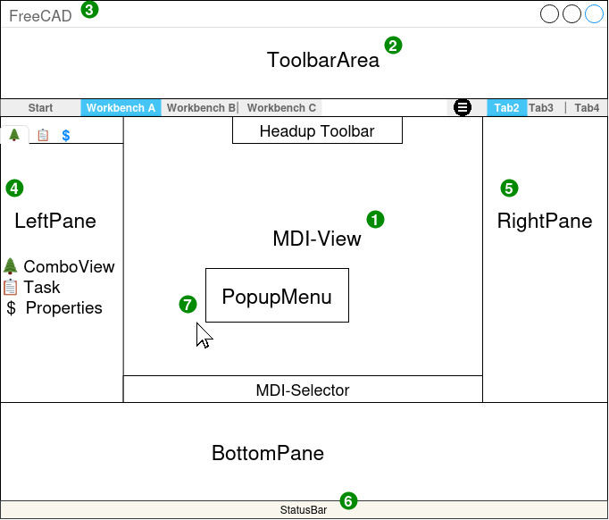

# Stylebook

The stylebook provides guidelines and explanations for visual elements in the FreeCAD application

This book is meant to document the general style and conventions of the FreeCAD User Interface. Guidelines, terminology, and philosophies described here will be used to justify changes in the current UI in order to make the overall user experience more consistent, predictable, intuitive, and attractive in the future.

In the short term, this book surely will undergo massive changes and reorganization. It will also serve as an important part of a larger discussion within the FreeCAD community. Feel free to link to existing issues and pull requests, and projects.

In the long term, the book should settle down and become primarily a resource for developers and designers to refer to. Most links should be removed.

Note: The stylebook is a catalog of _guidelines_.  These are not hard laws to be followed. The overarching principle is to make the user interface intuitive and welcoming. If blindly following a guideline does not serve that purpose, then ignoring the guideline is acceptable.  However, the _right answer_ is to refine the guideline here to account for what has been learned.

## Subpages
[Glossary](./glossary.md)  [Comboview](ComboView-History-of-an-Universe.md)  [MultiBodyPart VS. Assembly Problem](MultiBodyPart-VS-Assembly-problem.md) [Navigation](./navigation.md)  [Selection](./selection.md)  [Toolbars](toolbars.md)
[Task Panel](./taskpanel.md)

# Style Guide "ModernUI 23" FreeCAD  

This document is still a work in progress. Please leave a comment in the chat or highlight some text and click on the tooltip to comment.  
For reference: [https://freecad.github.io/DevelopersHandbook/stylebook/](https://freecad.github.io/DevelopersHandbook/stylebook/)  

This document assumes the TNP problem is solved.  

General Rule:

*   In the Head New things are started. 
*   In the Left Pane old things could be found and modified.
*   In the Right Pane access to external Resources is granted. 
*   In the MDI-View the current Main Activity is happend 
*   In the BottomPane Advanced user could see what happened in detail and modify on an advanced level 
    

  

## User Journeys  

*   [Importing 3D-Data](https://cryptpad.ccc-ch.ch/pad/#/2/pad/view/4zbaN2Oo1kq2Gy5y03VWOYCQykXtj3PBdknVQyGUZ18/)  
    

## Parts of the UI  

1.  _MDI-View (MDI =_ **Multiple Document Interface)**The _MDI-View_ lies between all frames. If no _Feature_ and no document is active, the _StartArea_ is shown, if no _Feature_ is active, but a document is loaded, the _3DArea_ is shown  
    *   _3DArea_  
        *   Contains the 3D-Model  
            
        *   Navigation Cube  
            Helps user to orienting relative to the document origin  
            
        *   In any case, the center for fit body is located in the middle between the current maximal width of all surrounding Panes and Bars  
            
    *   _SettingsArea_
        *   Standards  
            Units and other behaviors that affect appearances on data exports.  
            
        *   Settings  
            App and Workbench settings that do not have effect on data exports.  
            *   Global Properties for BOM  
                
        *   Add-ons  
            
        *   Import  
            
        *   Export  
            Allows saving settings. Per file type  
            *   e.g. [https://forum.freecad.org/download/file.php?id=187214](https://forum.freecad.org/download/file.php?id=187214)  
                
    *   _StartArea_  
        *   Contains the FreeCAD Start Screen  
            
2.  _ToolbarArea_  
    *   _WorkbenchSwitcher_  
        Tabs that allows switching to other _WorkbenchToolbar_  
        
    *   Feature Area  
        Contains Icons for _Features_.  
        
    *   HeadupToolbar  
        Contains Features that modify how MDI-View present the Content. Icons there should be Workbench independant. Workbenches could add Icons but do not replace them.  
        *   Icons should help see things either in an other way or select/mark data  
            
        *   It's not allowd to modify feature and content permanently  
            
        *   Has no influence on other data output than such made directly from the current MDI-View apperance.  
            
    *   _Feature_  
        *   A macro that could be run by clicking on an Icon. The Result is an additional entry in the _DataAndHistoryPane_ or a clickable object on the _3DArea_ (e.g. Sketch constrains) that allows modifying or removing the result of this macro.  
            
        *   Every Feature has a Description on wiki.freecad.org/{WorkbenchName\_FeatureName/LangCode} at least in English  
            
        *   Every Feature with a Property dialog to set up details of the command has a help page on wiki.freecad.org/{WorkbenchName\_FeatureName/LangCode} at least in English  
            
3.  _FreeCADMenu_  
    1.  Open, Save, Save as  
        
    2.  Export  
        Contains the Dialog from _SettingsArea/Export_  
        
    3.  Settings --> _SettingsArea_  
        
    4.  Collect and transfer all FreeCAD data  
        
4.  LeftPane:  
    1.  ComboView, Task, PropertyPane  
        [Details of ComboView](ComboView-History-of-an-Universe.md)
        [ComboView in Context of PartDesign]()
         --> See also the [MultiBodyPart vs. Assembly Problem](MultiBodyPart-VS-Assembly-problem.md)  
         
        TreeView, (DataAndHistoryPane): Every tree Item could have an "Edit" button that allows to modify specific settings for SubItems, a "Zoom" button to highlight and fit the zoom to contained data (if could be seen in 3D-Area)  
        1.  Components  
            Linked Documents  
            
        2.  _Model_ History  
            Contains the Model History  
            *   A switch (beside the Title) to deactivate the absorbing of related feature and shows a pure history  
                
            *   Linked Data  
                *   Origin (usually in sync with the document Origin)  
                    
            *   TimeBar  
                A Line that allows to set on which point of the History a new feature has to be inserted.  
                
        3.  ObjectList  
            Contain Objects and also their data.  
            *   ObjectProperties
                *   BOM (Document Properties and Data e.g. for BOM-Tables)  
                    *   Bodies  
                        
                    *   Bodygroup (AKA. SubAssembly)  
                        
            *   Mates between Models or Linked documents  
                
        4.  Reference List  
            List of data links from this document to external document  
            
    2.  _TaskPane_ (_Settings)_  
        *   Contain the settings of the currently active Feature  
            
        *   Contain the settings of currently selected data (Independent to active feature)  
            
5.  _RightPane: RessourcePane_  
    Access to external Resource from outside the FreeCAD Application  
    *   Libraries  
        
    *   Webservices  
        
6.  _StatusBar_  
    *   Contains nice to know data for current selections and the document itself  
        e.g. Length of selected data or current Volume or Weight of all bodies  
        
7.  _PopupMenu_  
    1.  _Leftclick_  
        *   Shows context data to currently selected data  
            and shows most used features for current selections  
            
    2.  _Rightclick_
        *   Shows context data to currently selected data  
            and shows less used features for current selections  
            
    3.  _Middleclick_  
        
    4.  _CustomXclick_  
        

  

## Rules for _Features_  

[Rules for Features](Rules-for-Feature.md)
        

## Rules for _PopupMenu_  

### Basics  

Example: [https://forum.freecad.org/viewtopic.php?p=582953#p582953](https://forum.freecad.org/viewtopic.php?p=582953#p582953)
  

*   Design Possibilities:  
    *   Placed on Mouse position:  
        On selecting one or more things a _PopupMenu_ appear in the up-right position of the mouse. If you increase the distant to the Popup, the popup more and more get transparent. On a certain distant the _PopupMenu_ disappear.  
        
    *   Placed as hovering Menubar  
        Like some Video Games use.  
        

### Content  

The Content of the _PopupMenu_ depend on the current working area. e.g. Sketcher, PartDesign, Assembly, TechDraw, etc.  

The _PopupMenu_ shows _Features_ that could work with selected content.  

*   The first row shows selected elements  
    
*   The second Row shows _Feature_ that could work with the current selections. Icons should be on predictable places.  
    
*   If more than one selection are available the features from left to right are sorted according to this rule:  
    1.  By the amount of selections a _Feature_ could use  
        
    2.  By the amount a _Feature_ is used.  
        
*   In the Example (_PopupMenu_ in Sketcher) there is no _Feature_ that could work with all three selections, so the first Icon is perpendicular. This _Feature_ could work with two selections and is the most used _Feature_ on the list.  
    
*   Feature that could appear on _PopupMenu_ should not depend on a certain selection order. Selection Order is only allowed if the Feature UI allows to easily swap them  
    *   It is not allowed to display a feature in the popup menu if there is a wrong selection order and this can lead to the user having to select the same selection again to complete the feature.  
        

⇒ This way, in the best case it could be possible that the _ToolbarArea_ is not needed and simple models can be created completely via CTRL-Key, mouse clicks and the resulting _PopupMenu_.  

## Don't Do it  

Popup Dialogs  

Popup Dialogs are easy to use but not user-friendly. PLEASE avoid them.  

*   If questions should be answered use the ComboView  
    
*   Dialogs that show only an OK button normally do not get read by the user.  
    
*   Dialogs that show an Abort and OK are not able to show what really would happen, also given settings normally get lost.  
    *   Proceed further  
        
    *   Allow cancel long going Calculation  
        
    *   Show the Problem in the _ComboView_  
        
    *   Allow saving logs of the Problem  
        
    *   Create a more user-friendly output of the log. If possible link to a help page for that case.  
        
*   "I need space for a complex setup!"  
    Choose from these possibilities:  
    *   Temporary increase the width of the _SettingsTaskPane_  
        
    *   Replace the _3DArea_ with a settings page.  
        e.g. Mockup: [https://forum.freecad.org/download/file.php?id=187214](https://forum.freecad.org/download/file.php?id=187214)  
        If you need the 3D-Model to select something, I recommend including it as a Frame into the settings page.

## Widgets

#### Guidelines

1. FreeCAD has a custom QT widget for displaying units. The control will convert the displayed units based on the users selected unit schema.

## Tables

When a table is used to display rows of items with multiple elements, such as the workbench preference page, the first column should be the icon/name of the element. This first column can be preceded by a checkbox only if it is an activation checkbox. The rest of the UI elements should follow after, in an order that makes the most sense to the user.

## Terminology

FreeCAD has a major terminology problem for new users. We have a Part workbench that doesn't make Parts and a Part Design workbench that isn't used to design Parts. We have Pads and Extrudes, Pockets and Cuts, Fuses and Unions, etc. We have a Part container and a Group container(?) but no core functions to populate a container (e.g. a core assembly function).

## Philosophy

There should be one -- and preferably ONLY one -- obvious way to do a task. Developers are notorious for giving users options thinking that is a good thing. In reality, every tool takes time to understand. Given two nearly identical implementations of the same workflow, the user has to figure out how they differ. Don’t make the user think.

Never present the user with an enabled tool that is broken, non-functional, or cannot be used in the current context. Some examples:
- It should not be possible for the user to initiate the 'export' operation
   without a document open because there is nothing exportable.
- A workbench which requires the user to install something extra to be useful
  should not be part of the workbench switcher if the extra thing is not installed.
- A toolbar tool that groups related tools together should be disabled if all
  the sub-tools are disabled.

## Resources

Here are some resources concerning UI/UX design.

[Don't Make Me Think: A Common Sense Approach to Web Usability](https://www.amazon.com/Dont-Make-Me-Think-Usability/dp/0321344758) by Steve Krug - A decent book mostly about web usability but the core ideas are sound.

[Laws of UX: Using Psychology to Design Better Products & Services](https://www.amazon.com/Laws-UX-Psychology-Products-Services-ebook/dp/B087F24RJB) by Jon Yablonski 

[The Design of Everyday Things](https://www.amazon.com/Design-Everyday-Things-Revised-Expanded-ebook/dp/B00E257T6C) by Donald A. Norman - A great introduction to design concepts like affordances and signals.
