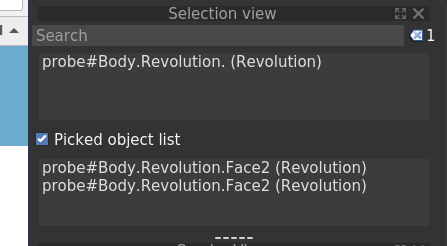

# Selection

Reference: [FreeCAD Wiki - Selection Methods](https://wiki.freecad.org/selection_methods)

### Terms

1. Selection: the set of objects and subobjects that the user has selected
2. Pre-selection: the object directly under the pointer which will be added to the selection if the user clicks
3. Selection View: The panel which allows the user to see the selection items
4. Greedy selection: Mode in which additional items are added to the selection without requiring a modifier key
5. Selection gate: Logic which can be initiated via code that controls which objects may be selected
6. Selection observer: Logic which can be initiated via code that watches the selection. It can be used to trigger actions under specific selection conditions.

### Guidelines

1. Selection gates and observers are powerful tools for adjusting the affordances of the GUI and providing signals. They must be used with care because they can adversely affect the performance of the GUI. 
2. If the user is asked to select multiple features, he should be able to select by clicking them, and unselect them as well by clicking on selected features.

### Items to address

These items need to be written about
- If the selection order is relevant for the outcome of a command, does the 'main' object come first or last?
- Selection and deselection of geometry references: generic, for solids and shells, for faces, for edges, for points, for a limited set of these. Should be unified, might need variants for selection of a single reference or multiple.
