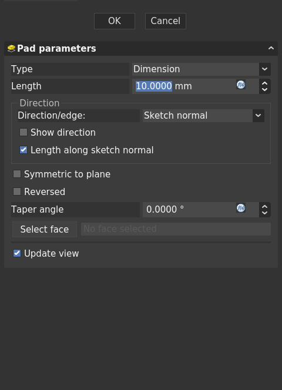

# Task Panel

The task panel appears in the Tasks tab of the combo view, one of the important panels of the interface.

A task panel is opened when a user uses a tool that requires additional user input to complete.  A task may remain open for a long time while the user does significant work.  ie Padding a sketch.

# Guidelines

## 1. Transactions

All task panel activity should be encapsulated in a transaction. This allows the undo/redo system to revert the work done by the user in the context of a task.

## 2. Interactivity

While the contents of the task panel can vary widely based on the specific details of the task, all task panels fall into one of two categories:

### 2.1 Live Preview

While the user is adjusting the settings and properties reflected in the panel, the result is updated in realtime in the 3D window allowing the user to preview the result.  The toolbar at the top of the panel will have an 'ok' button to confirm the settings and exit the task.  A 'cancel' button will dismiss the task, cancel the transaction, and revert the document to the state it was in prior to initiating the task.

### 2.2 Apply Button

Some task require considerable computational resources to complete.  In this case,  live preview isn't practical.  For these cases, a third button is available at the top.  'Apply' will initiate the applicaton of the settings and update the model.  The task will remain open and the user will still have the option to accept or reject the result.

## 3. Create and Edit Panels

Many commands create a new element or object in the tree.  Double-clicking on this object should display the task again to allow editing of the object.  The edit and create tasks should be, ideally, the same panel.  In cases where separate panels are required, they should be as identical as possible.

## 4. Panel Widgets

### 4.1 Units
All widgets that display FreeCAD units (length, radius, angle, velocity, etc) should use the FreeCAD Custom widgets provided by the [Qt designer plugin](https://wiki.freecad.org/Compile_on_Linux#Building_with_Qt_Creator_against_Python_3_and_Qt5)
### 4.2 Default values
Task panel inputs should provide default values that are reasonable and helpful to the user. The user should not be required.  A general rule of thumb is that if the user initiates a task and immediately hits 'ok' the task should complete and produce a reasonable result. Even if the result is not exactly what the user intended, it should help the user understand what the tool is intended to do.

### 4.3 Placeholder values
In cases where user input is absolutely required to continue (eg creating a shapestring requires the user to say what the string text is) the input field should use a placeholder value. A placeholder differs a default value.  A default is usable while a placeholder simply conveys the type of information expected.  Until all required fields are populated, the 'ok' and/or 'apply' buttons should be disabled.

Required and Placeholder inputs should be kept to an absolute minimum.

### 4.4 Tooltips
All controls should provide helpful tooltips

### 4.5 Labels
Fields should have proper labels which are translatable.

## 5. Layout

### 5.1 Order
Input fields should be placed in the task panel in an order that maps to typical user expectation.

### 5.2 Tab order
The cursor should move from field to field when the user presses the tab key. The tab order should follow the visual order on in the panel from top left to bottom right.

