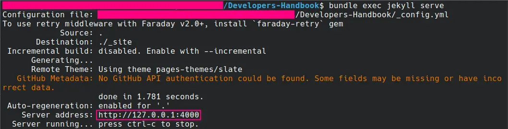
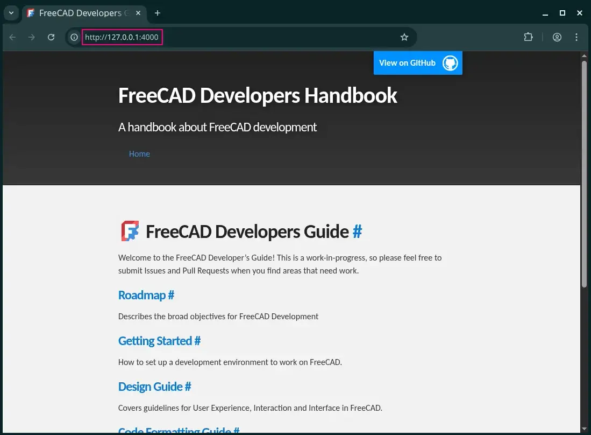

# Contributing to the Handbook

Some information for people that want to work on this handbook.

<br/>

## Setup ( Linux )

The handbook uses [Jekyll] to render
markdown files as a static website.

<br/>

### Repository

Clone the repository to your system.

```sh
git clone https://github.com/FreeCAD/DevelopersHandbook
```

And navigate to the repository folder.

```sh
cd DevelopersHandbook
```

<br/>

### Dependencies

Install [Ruby] and the build essentials.

```sh
sudo apt install    \
    build-essential \
    ruby-bundler    \
    ruby-dev

bundle install
```
<br/>

## Editing

While editing the markdown files, run Jekyll.

```sh
bundle exec jekyll serve
```

Open the address shown in your terminal in
your browser - usually it's `127.0.0.1:4000`





<br/>

[Jekyll]: https://jekyllrb.com
[Ruby]: https://www.ruby-lang.org
