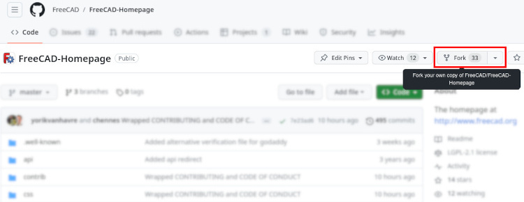
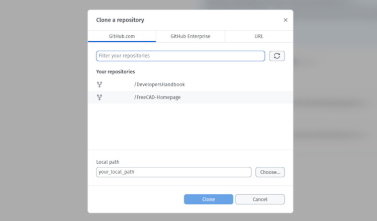
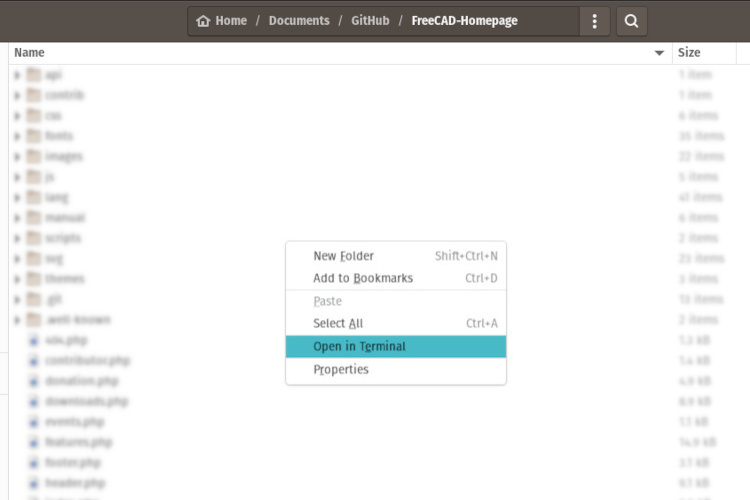
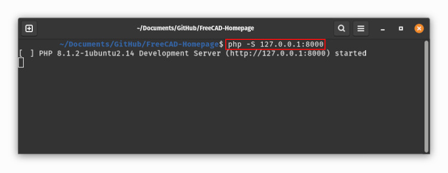
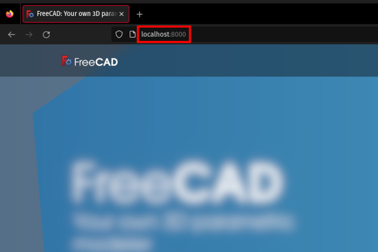

# Contributing to the FreeCAD main website

Technical information for contributors interested to work on FreeCAD main website.

## Structure

TODO

## Running locally

During development and before committing your changes, you may want to display the website in your web browser locally, without installing a full web server solution stack like XAMPP.\
You can instead just transcribe the PHP files into HTML that your web broswer can read.

1) To do so, fork the original FreeCAD-Homepage repository to your personal GitHub account :

2) If you don't have an account or prefer to inspect and modify files locally without relying on GitHub's features, download the compressed folder and unzipp it :

3) From GitHub Desktop app, clone the fork you just created (skip this step if you downloaded the zip in step 2) :

4) Make sure PHP is installed on your system (on GNU/Linux in 2023, install the PHP8 CLI package).

5) Go to your local cloned copy of the repository, in the folder you specified previously ("FreeCAD-Homepage" in this case), and open the terminal at working-directory location :

6) Paste `php -S 127.0.0.1:8000` to start the PHP server locally:

7) Open a new tab in your web browser with `localhost:8000` to display the "index.php" file of the web page correctly.\
If you want to reach a particular file, use `localhost:8000/MyFile.php`.

N.B: the translation of the web pages does not work.

## Design guidelines

TODO

## Managing translations

TODO

## Ressources

TODO