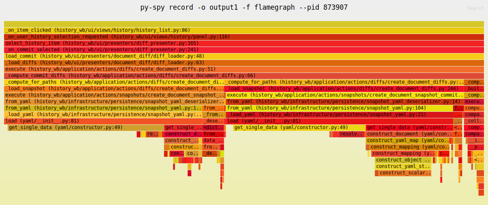
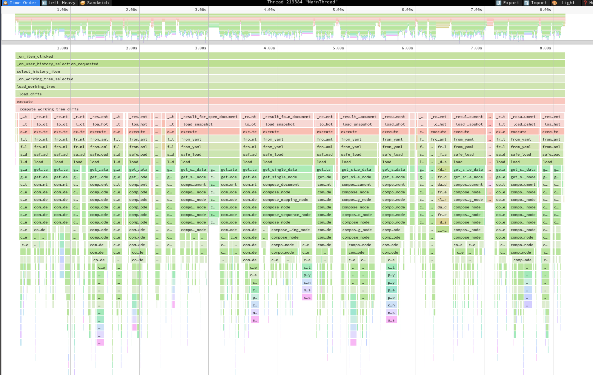

# Profiling Python Code

Profiling an application is a way to understand where it spends time while running code. This page details how to profile Python code running within FreeCAD to generate a flamegraph, which is a visualization of function calls over time. It makes it easier to spot slow or frequently used functions in order to identify bottlenecks.

The instructions outlined here are useful for both built-in Python code and third-party addons.

## Using py-spy

[`py-spy`](https://github.com/benfred/py-spy) is a sampling profiler that attaches itself to running Python programs without having to restart them.

First, install `py-spy` by following the installation guide in py-spy's readme file linked above.

Before running the profiler, start FreeCAD and take the steps required to get you to the point right before running the code you want profiled. For example, if you want to profile a complicated third party workbench that analyzes geometry, you may take the steps to activate the workbench in the FreeCAD GUI, open a task panel, fill out the form, and stop before confirming the task panel which runs the code you want to profile.

Next, find the process ID of the running FreeCAD program. Although there are many ways to do this, the easiest is to open your Monitor / Task Manager application on your operating system, and search for "freecad". It'll display the ID corresponding to the running FreeCAD instance. There are also CLI commands you can run, such as `pidof freecad` on Linux, or `ps aux | grep -i freecad` on Linux/Mac.

Now it's time to start the profiler. Run the following command from the command line, making sure to replace the pid value with the process ID you found above:

```shell
py-spy record --output my_results --pid 123456 --duration 15 --format speedscope

# Functionally equivalent:
py-spy record -o my_results --pid 123456 -d 15 -f speedscope
```

Argument explanation:

- --output / -o: output filename
- --pid: the process ID
- --duration / -d: duration of profiling, in seconds
- --format / -f: profile result format

You may omit the duration parameter to profile indefinitely. Pressing `CTRL+C` to quit the program writes the results to the output file.

The file format can be one of:

- flamegraph: outputs an SVG image with limited timing information
- speedscope: creates a file that can be opened with the open-source [speedscope](https://github.com/jlfwong/speedscope) application, which provides an interactive viewer with zooming and detailed function information. It's also conveniently hosted at https://www.speedscope.app/
- raw: outputs raw function calls in text format
- chrometrace: outputs a file that can be opened in Chrome-based browsers by entering `chrome://tracing` in the address bar.

On Linux and Mac, if you get a permission error running `py-spy`, you need to use `sudo` to run it, e.g. `sudo py-spy record ...`. This is because it works by reading memory from a different Python process, which might be blocked by the operating system for security reasons.

After the profiler starts, run the action that executes the code you want to profile, e.g. confirm the task panel dialog. When done, you may either wait for the configured duration to elapse, or press CTRL+C to quit and write the output file.

Below are example outputs from the profiler.


*SVG output from the `flamegraph` format.*


*Screenshot from the `speedscope` viewer. It clearly identifies YAML loading functions as taking the majority of the 8-second run time, making it a clear target for optimization work.*

For more information about options available and troubleshooting, refer to the `py-spy` documentation.
