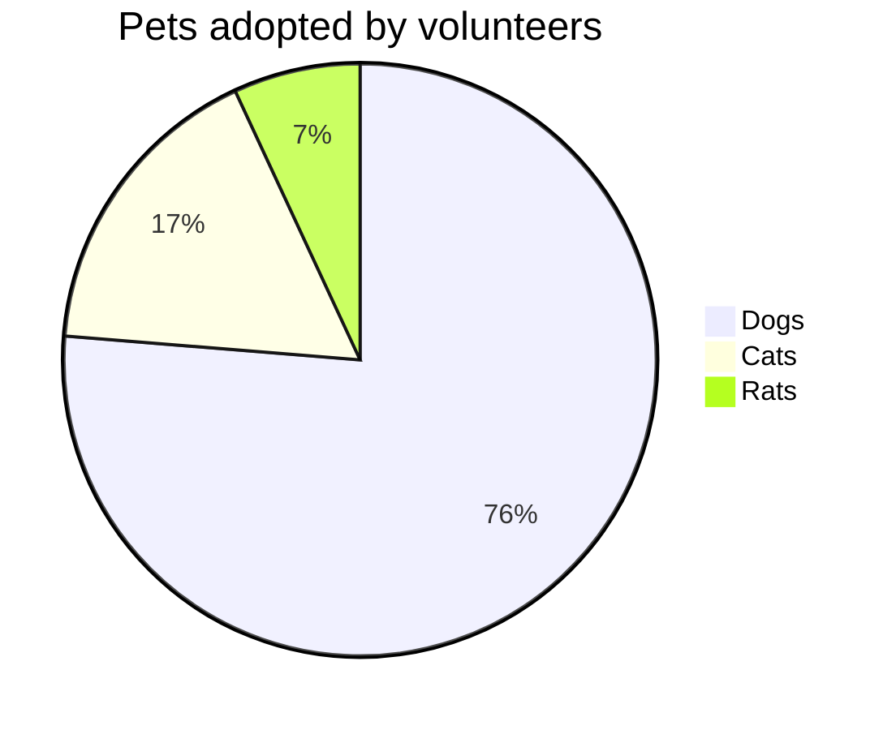
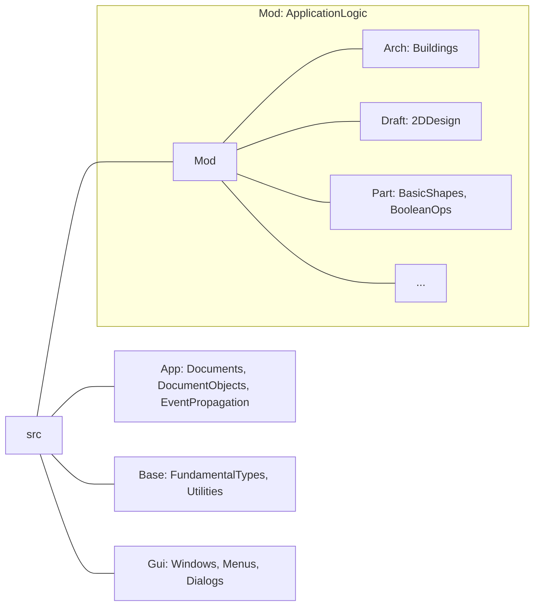

# Partial View of the FreeCAD Source Tree

The full FreeCAD source tree has many other branches, but most Contributors will
only need to deal with these:

or

@startmermaid
pie title Pets adopted by volunteers
  "Dogs" : 386
  "Cats" : 85
  "Rats" : 35
@endmermaid

graph TD;
    A-->B;
    A-->C;
    B-->D;
    C-->D;

## Any change in web page?
