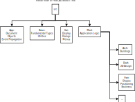
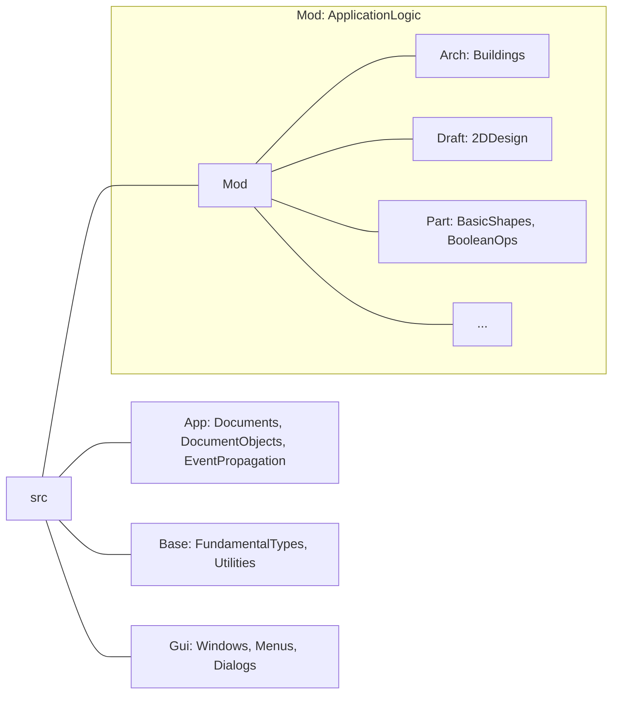

# Partial View of the FreeCAD Source Tree

A picture of the most commonly encountered branches of the tree.

The full FreeCAD source tree has many other branches, but most Contributors will
only need to deal with these:

