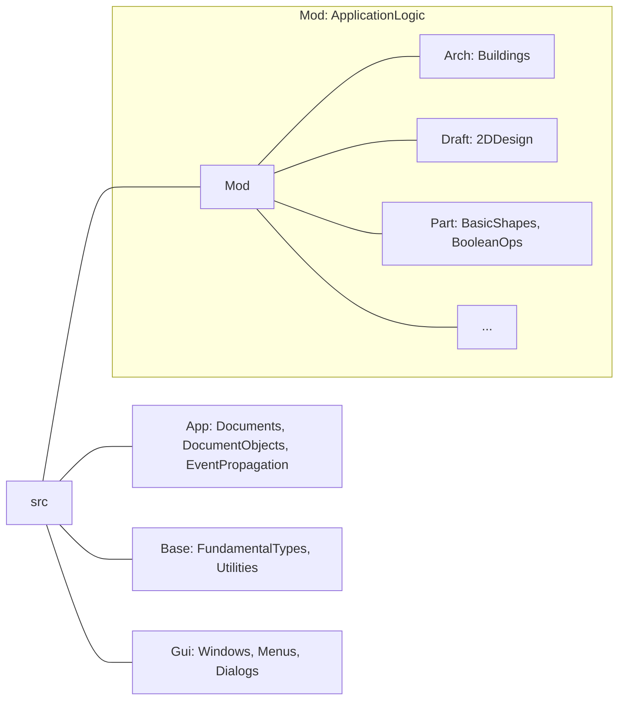

---
title: "Partial View of the FreeCAD Source Tree"
description:
    "A picture of the most commonly encountered branches of the tree."
layout: default
mermaid: true
-—
# Partial View of the FreeCAD Source Tree

The full FreeCAD source tree has many other branches, but most Contributors will
only need to deal with these:

