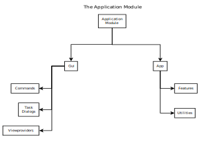

# The Application Module

An overview of application module structure.

The functionality of FreeCAD is separated into Modules. Some Modules are built into FreeCAD and some are Extension Modules (a form of plug-in). Once installed, Extension Modules behave exactly as built-in Modules.

Application Modules provide specialized functions and may store specialized data. Examples of Application Modules are Arch (for buildings) and Sketcher (for drawing Sketches).

Application Modules are almost always divided into two parts: App which manages the relevant document objects and operations on them, and Gui which handles the display.

